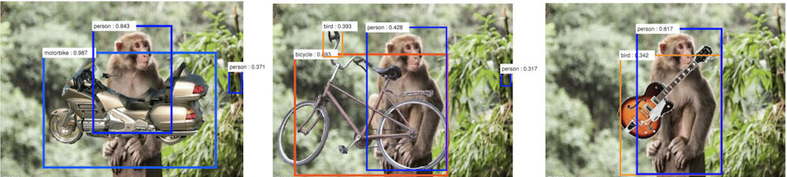

两年前，AlphaGo 在乌镇击败围棋世界冠军柯洁，人工智能也因此受到了越来越多的关注。抱着对人工智能的好奇与敬畏，我在 Coursera 上找到了 Andrew Ng 的机器学习课程，打算一窥人工智能的究竟。然而，在学习了几节课之后，我便失望的关闭了网页。原来如今发展迅速的深度学习与机器学习的原理只是统计学、函数拟合与最优化等平凡的数学方法，而不是我想象中的黑科技。因此，很长的一段时间内我都对人工智能不感兴趣，因为我知道，光凭现在的方法人工智能是不可能超越人类智能的，人工智能想要超越人类智能必须在基础原理上有所突破。

而如今，我对这个问题有了更深的理解。首先，我们该如何比较两个智能孰高孰低？我们知道，在记忆、计算这些方面计算机早就可以碾压人类，而在图像识别等领域人工智能最近才达到了人类水平；蝙蝠能够通过超声波的反射来判断不同方向障碍物的距离，在黑暗中也不受影响，而人类却无法通过声音来判断距离。智能不是单一维度的，人类的智能囊括许多方面：语言，思维，行为……现今的人工智能可能在单一领域可以战胜人类，如围棋、图像识别，人工智能的胜率和准确率已经可以超过人类，但是人工智能其实仍然没有超越人类智能。人工智能在进行图像识别时只是利用统计学原理来进行判断图片中的东西是什么，而并不真正理解这是什么。因此，人工智能在面临极端罕见的情况时往往会失误。如下图所示，在一只猴子的手上放上摩托车、自行车、吉他等物时，人工智能将猴子判断成了人类，因为这些东西往往与人类同时出现而不会与猴子同时出现[2]。而在极端情况下的失误又有可能酿成大祸，比如自动驾驶系统可能从来没有见过坐在马路中央的婴儿，如果真的遇见这种情况则可能无法准确判断。

近些年的人工智能浪潮起源于人工神经网络，其思想来源于对人脑的研究。想要实现能够整体超越人类智能的“通用人工智能”，一种方法是对大脑进行进一步研究，对人类智能的原理有更深入的了解。然而，当我们真的完全按照大脑的原理实现了一个人工智能时，会不会发现这个人工智能的运算速度甚至不如人脑呢？也许我们还需要在人脑的基础上做更进一步的改进。

其实，现在的不能超越人类的人工智能也很有价值。人工智能已经开始逐渐取代人类完成一些简单的工作，在未来，人类也许可以都去进行创造性工作，让人工智能完成体力劳动和技术性工作，使共产主义社会成为现实。假如人工智能某一天真的完全超越了人类，我们要思考的问题是人类还有什么存在的意义。

## 参考文献

[[1]](https://www.wired.com/2017/04/the-myth-of-a-superhuman-ai/) Kevin Kelly. "The Myth of a Superhuman AI" (2017). WIRED

[[2]](https://arxiv.org/abs/1711.04451) Wang, Jianyu , et al. "Visual Concepts and Compositional Voting" (2017).